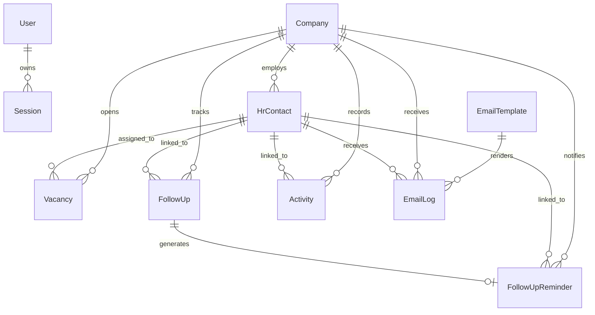

# Database Design

This project uses Prisma with SQLite and keeps the existing Prisma model names so the current application remains compatible.

Conceptual prompt-to-schema mapping:

- `User` -> `User`
- `Company` -> `Company`
- `HR` -> `HrContact`
- `Vacancy` -> `Vacancy`
- `Timeline` -> `FollowUp`
- `EmailTemplate` -> `EmailTemplate`
- `Notification` -> `FollowUpReminder`
- `ActivityLog` -> `Activity`

## ER Diagram

## Table Purpose

### User
Stores authenticated application users.

Why it exists:

- Supports username/password login.
- Stores the user profile and role information for future authorization.
- Keeps session ownership explicit.

### Session
Stores login sessions for the custom authentication flow.

Why it exists:

- Enables persistent authentication without NextAuth.
- Allows safe session expiration and revocation.

### Company
Stores every hiring company account.

Why it exists:

- Acts as the parent record for HR contacts, vacancies, timelines, notifications, emails, and activity.
- Centralizes company metadata such as industry, size, city, and status.

### HrContact
Stores HR or recruiter contacts linked to a company.

Why it exists:

- Powers HR management, duplicate detection, follow-up scheduling, and contact search.
- Keeps person-level communication data separate from company-level data.

### Vacancy
Stores open or in-progress roles for a company.

Why it exists:

- Tracks hiring demand, assigned recruiters, priority, and status.
- Supports vacancy search and dashboard metrics.

### FollowUp
Stores follow-up tasks and timeline entries.

Why it exists:

- Powers dashboard follow-up widgets and HR profile timelines.
- Keeps scheduled work separate from reminders so task history stays durable.

### Activity
Stores audit-style timeline entries such as updates, calls, emails, and deletions.

Why it exists:

- Gives each HR profile a chronological activity trail.
- Makes CRM actions traceable for the team.

### FollowUpReminder
Stores the notification record generated from a follow-up.

Why it exists:

- Supports the dashboard notification bell and daily reminder sweep.
- Lets reminders be marked done or dismissed without deleting the underlying follow-up.

### EmailSettings
Stores SMTP configuration for the email module.

Why it exists:

- Keeps delivery credentials and sender details in the database.
- Allows the email module to be edited without redeploying the app.

### EmailTemplate
Stores reusable outbound email templates.

Why it exists:

- Powers the editable templates used for introduction, follow-up, reminder, and thank-you emails.
- Keeps the content versioned and easy to seed.

### EmailLog
Stores a delivery record for every sent email.

Why it exists:

- Preserves success and failure history for auditing.
- Lets the UI show a chronological email trail for a company or HR contact.

## Design Notes

- Soft delete is supported with `deletedAt` on all business tables.
- Compound and single-column indexes are added for dashboard queries, search filters, and notification sweeps.
- Existing relations remain stable, so the application can evolve without renaming tables or breaking seeded data.
- The schema keeps SQLite-friendly primitives only, which makes local development and migrations predictable.

## Seed Data

The seed script creates:

- One admin user
- Sample companies
- Sample HR contacts
- Sample vacancies
- Sample follow-ups
- Sample notifications
- Sample activity log rows
- Default email settings and templates
- Sample email log rows

This provides enough data for the dashboard, search, company, HR, vacancy, and email modules to render immediately after setup.
